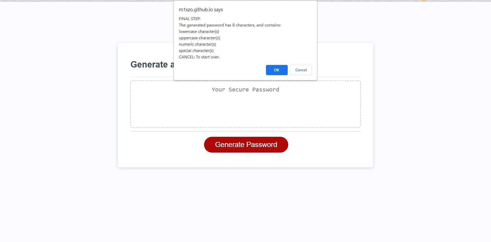

# javascript-password-generator
Secured Password Generator

## Description

An application that enables employees to generate random passwords based on criteria that they’ve selected. This app will run in the browser and will feature dynamically updated HTML and CSS with a responsive user interface that adapts to multiple screen sizes.

## Installation

N/A

## Usage

After click on the button to generate a password, a series of prompts appear asking for password criteria from user input. Press OK to include the criteria for evaluating password and CANCEL to neglect them. 
- If length is included by the user, the application prompts for the length of the password from user input and the length entered should be at least 8 and no more than 128. If user input does not meet the requirements, user is not able to proceed to the next step, by pressing CANCEL, then the length is auto-generated. 
- If character types are included, then a series of prompts appear asking user to confirm whether or not to include lowercase, uppercase, numeric, and/or special characters. At least one character type should be chosen, otherwise an alert appears and asking user to re-select the types. 
- If none of the criteria are included, then a series of prompst appear asking if user want an auto-generated password without criteria, by click on CANCEL, the starting prompts asking user to select criteria re-appear. If user choose to proceed with auto-generated password, the length of password(8-128 characters) is randomly selected by computer, and user can choose to include all character types or randonly selected types by computer. 
- After the inputs have been validated, the application will ask for an confirmation from user, user can also choose CANCEL to start over. The generated password is then writeen to the page in the destined text area after confirmation.

## Screenshot

The following image shows the web application's appearance and functionality:

## Link

[Deploy Link to the web application](https://m1xzo.github.io/03chl-javascript-password-generator/).

## Credits

N/A

## License

Please refer to the LICENSE in the repo.
